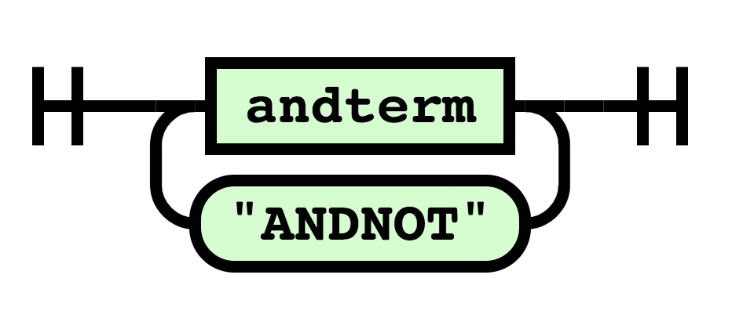
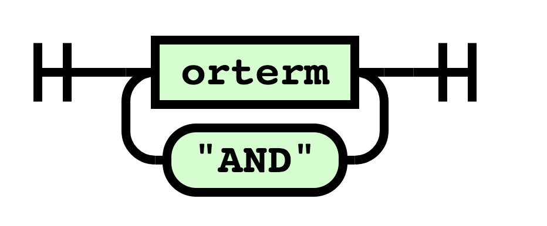

# INF-1101 - fei003 - a2
This report details the implementation of an indexer that supports indexing of text documents and evaluation of queries to filter words within the indexed documents. The filtering mechanism is based on a context-free grammar (CFG) that describes the unambiguous rules for determing the legal expressions of the query language. 

The intention of the indexer is to use it for a basic search engine that has a simple web interface for evaluating queries on a set of documents located on the host, and returns a link to the matching files. Users of this web interface can search on either single words or a combination of words using the language described later in this report. 

## 1. Technical background
The assessment can be into two main problems. Each problem can then be further split into sub-sub problems. For instance:

* **Parsing:** ambiguity, sanitizing input, error handling etc.
* **Indexing:** containers, algorithms, caching etc.

The biggest problem of this assesment is the filtering mechanism described in the introduction. To be able to filter the words in the documents, the program requires a parser that can take the input (query) of a user and produce something meaningful out of it. 

The data structures and algorithms used in this assessment was already done in the pre-code of the assessment. No elaboration on the implementation nor the benchmark of the algorithms or data structures is present in this report.

### 1.1 Parsing
[[1]](#f1) describes ambiguity in a single word as a word that can be understood in two or more ways, and it's often referred to as ___lexical ambiguity___. The nature of CFGs has it origins in human languages, and is therefore prone to being ambigous. The CFG used in this asessment is called _Backus Naur Form (BNF)_.

The BNF describes our CFG, which is a set of rules used to describe or query language. The syntax is:
* ` query ::=  andterm | andterm "ANDNOT" query `
* ` andterm ::= orterm | orterm "AND" andterm `
* ` orterm ::= term | term "OR" orterm `
* ` term ::= "(" query ")" | <word> `

The syntax diagrams below helps visualize the syntax.

**Query:**

A `query` is an `andterm` or an `andterm` combined with `"ANDNOT"` and a `query`.

**Andterm:**

An `andterm` is an `orterm` or an `orterm` and `"AND"` combined with an `andterm`.

**Orterm:**

An `orterm` is a `term` or a `term` and `"OR"` combined with an `orterm`.

**Term:**

A term is an opening parenthesis `"("` followed by a `query` followed by a closing parenthesis `")"`, or a `word`.

What we can see from the figures above is that the parenthesis in the `term` is what is keeping this syntax from being 

### 1.2 Indexing
[[1]](#f1) defines an abstract data type (ADT) as a data type whos operations are accessible through an interface, and has its implementation hidden from the client (a program that uses an ADT). 

What this inherently means, is that the same set of operations can have several different implementations, and that the client can safely switch betweeen implementations without breaking existing code (as long as the contract of the interface is held).

For implementing an index ADT, an interface that described the operations with its return types was predefined in the precode (see source).

## 3. Implementation

---- Skriv at syntax parsinga e recursive descent parser med "top down approach?"

When deciding on which way to implement the sorted set, two alternatives were considered. One that would have low development cost but high performance cost and vice versa. These are trade offs that often has to be considered in real life situations when developing software (i.e., development cost vs optimal performance), so this was a good exercise.

The sorted set implementation was done using the linked list implementation given in the precode. This is by far the slowest (in terms of run time), naive and reckless implementation (compared to other implementations). Very little effort went into optimizing the code. As long as the tests passed, it was fine. The positive part of this implementation was its low development cost (time), which was the prioritized factor for this assignment.

The caveat of using a linked list implementation for the set was definitely the sorting algorithm. This is due to the fact that the set had to be a *sorted* set, hence, the sort of the linked list had to be invoked on every add call.

## 4. Discussion
For benchmarking the `set_add` function, three sets of data with 450 elements were generated, one with random numbers, one with increasingly larger numbers and one with a constant value. 

The figure below depicts three different types of complexity. The worst case was with random numbers (blue graph), which is O(n * lg n), second worst was the increasingly larger numbers (orange graph) which follows a more linear time complexity of O(n) and the third and the best case was when adding the constant value (red graph).

The best case scenario was due to the fact that the `set_add` function, which invoked a mergesort sorting algorithm, never had to sort anything. The worst case scenario was due to the `set_add` having to sort the set on every call.

The `set_intersection`, which has an identical time complexity as `set_difference` and `set_union`, had a time complexity of O(n). This is due to linked list `list_contains` having a time complexity of O(n).

## 5. Conclusion
Apart from a few, minor caveats, the code is working as intended. There are obvious improvements to be done in the implementation of the set, but poor design choices were taken due to some time constraints.

## References
<b id="f1">1</b> Cecilia Quiroga-Clare, _Language Ambiguity: A Curse and a Blessing_ [Online]. Available:
http://www.seasite.niu.edu/trans/articles/Language%20Ambiguity.htm

<b id="f2">2</b> Robert Sedgewick, 1997. _Algorithms in C, Parts 1-4: Fundamentals, Data Structures,
Sorting, Searching: Fundamentals, Data Structures, Sorting, Searching. 3 Edition._

